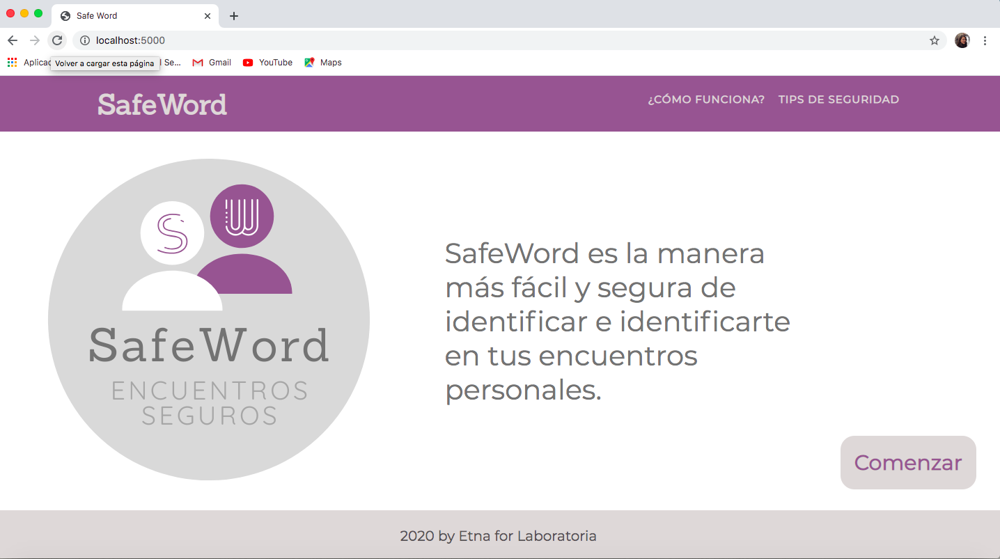
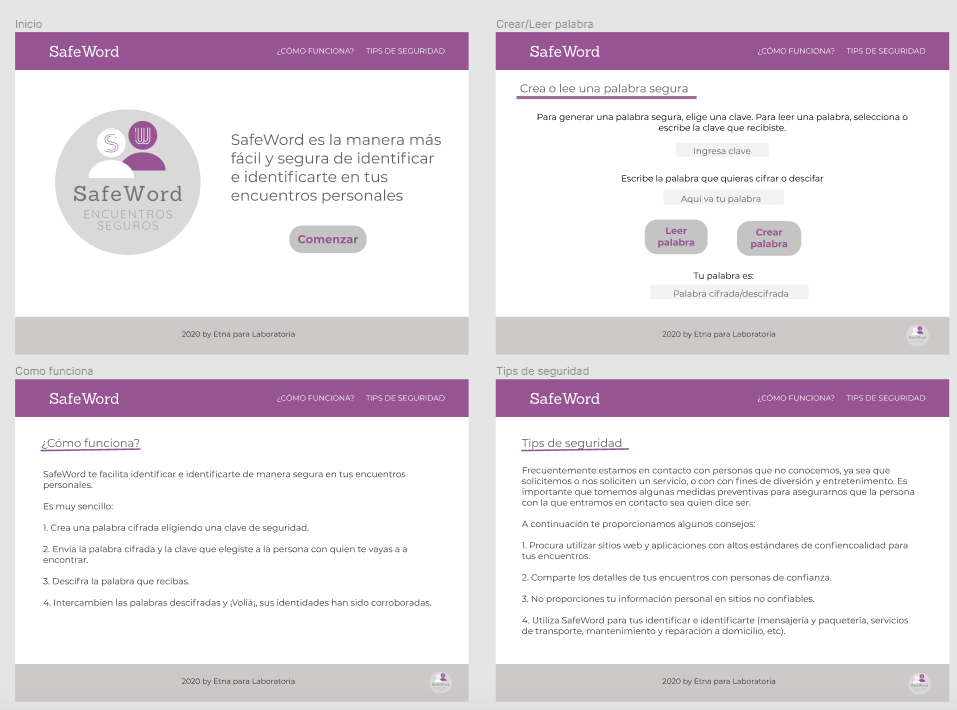

# SafeWord

SafeWord es una aplicación que facilita la identificación de las personas que participan en un encuentro personal por medio de la generación de palabras seguras que se intecambian al momento del encuentro.

## Investigación UX:

  1. La aplicación está dirigida a personas que ofrecen/reciben productos y servicios, como transporte particular, mensajeria y paquetería, servicios de mantenimiento a domicilio, etc. También para usuarios de plataformas de encuentros con fines reacreativos y sociales. El objetivo de SafeWord es proporcionar un sistema de seguridad, por medio del cual, se pueda verificar la identidad de las personas en ambos sentidos.

  2. La preocupación de los prestadores de servicios por resguardar la seguridad de los usuarios  va en incremento, SafeWord surge como una propuesta que responde a las siguientes necesidades básicas:

    - Es amigable y fácil de usar, teniendo incluso un sentido lúdico.
    - Es una forma sencilla de aumentar la seguridad en sus actividades cotidianas.  
    - Genera un sentimiendo de confianza y fiabilidad.

  

  4. Con el feedback de posibles usuarios se realizó una optimización del prototipo, disminuyendo el número de pantallas a utilizar, esto se logró al unificar en una pantalla las opciones cifrar/descifrar (indicadas al usuario como "Crear
  palabra segura" o "Leer palabra segura"). También se sintetizó la sección de "Cómo funciona" y "Tips de seguridad" para que fuera más accseible y sencilla de leer. Se cambió el color de fondo, aumentando así la sensación de orden y limpieza en la aplicación.

  
